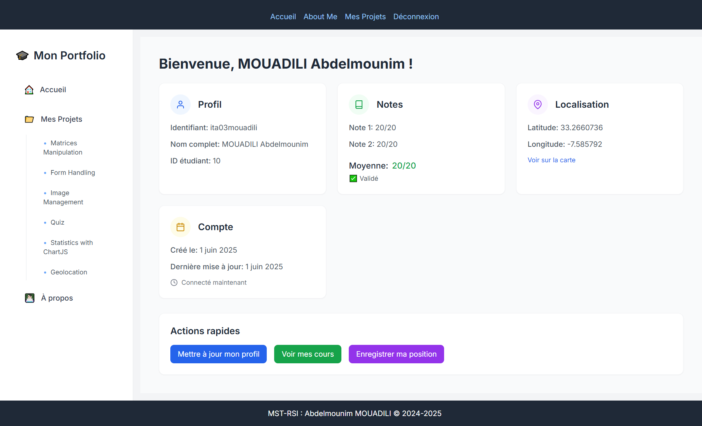
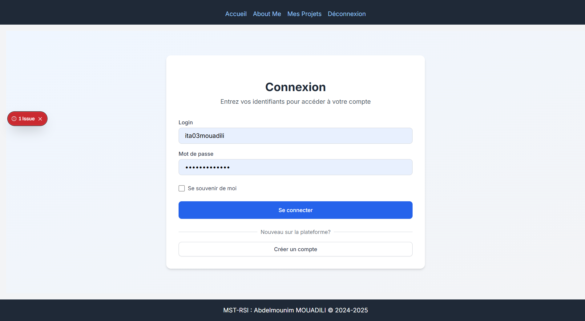
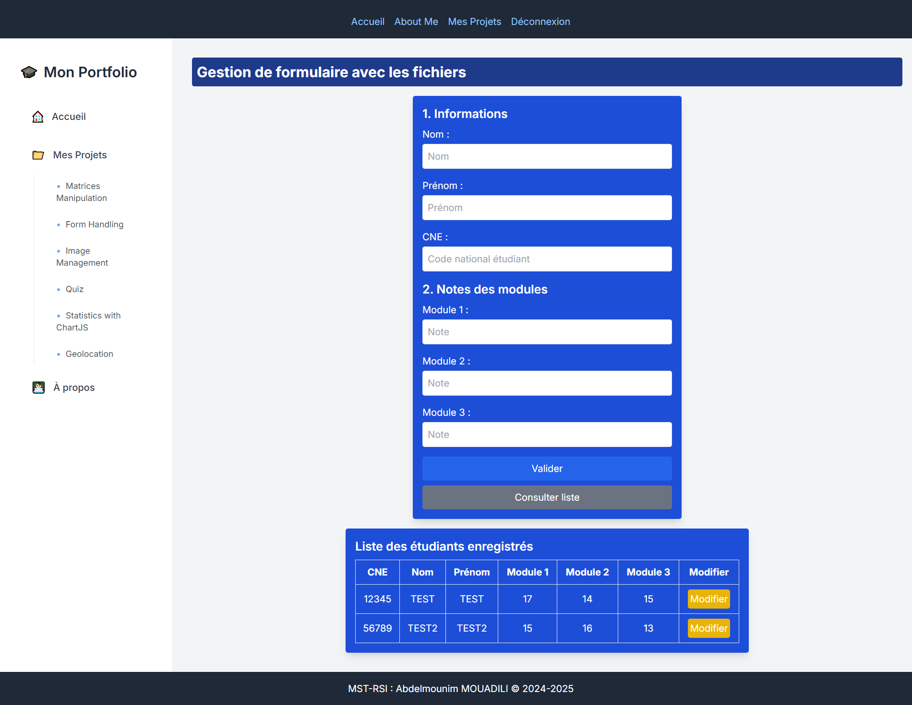
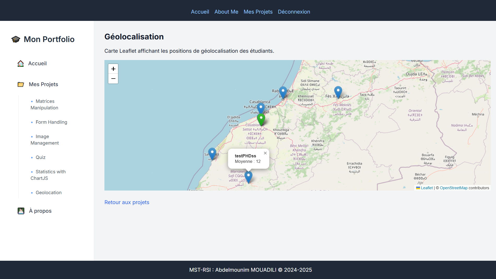
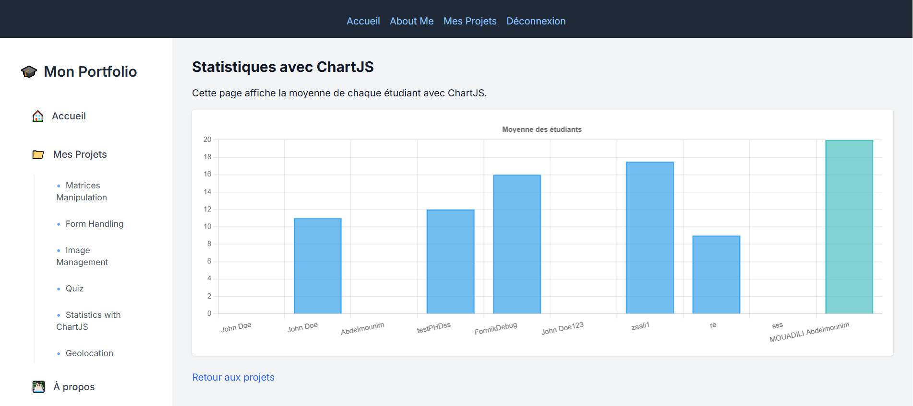
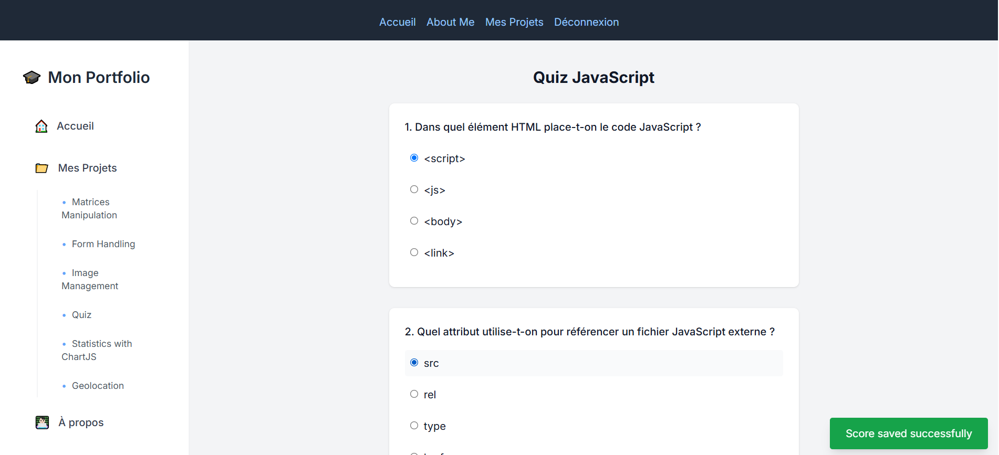
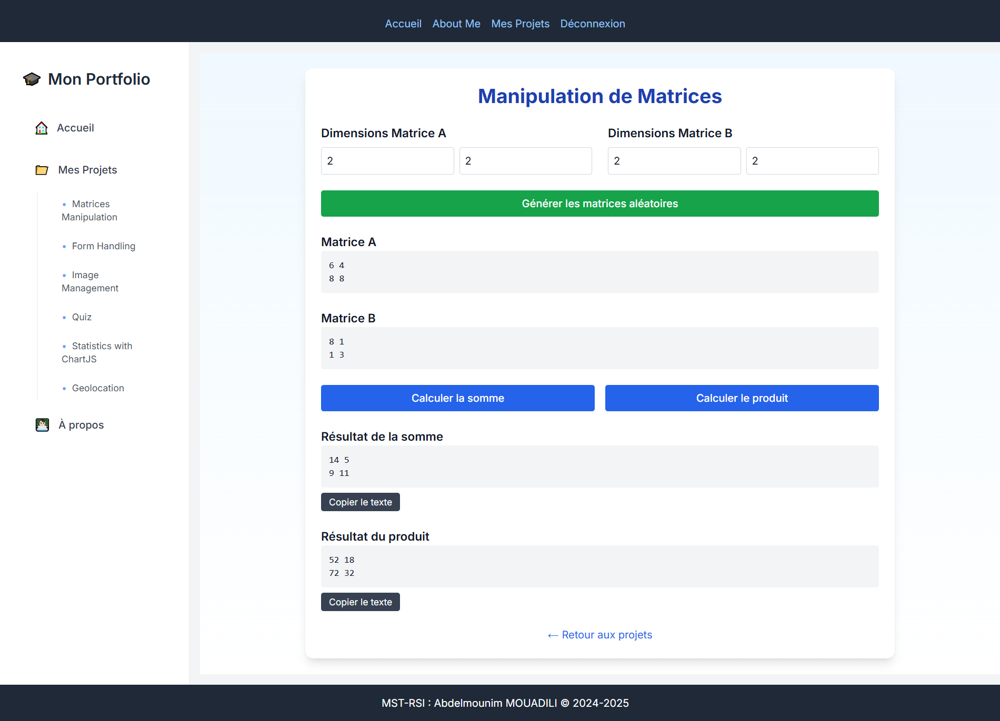
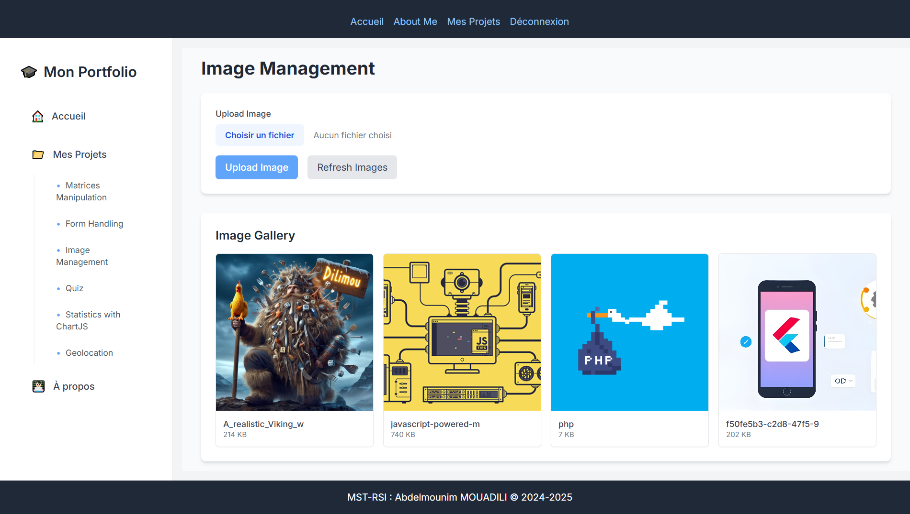

# Master RSI – Full Stack Project

Ce projet combine à la fois le service d'API backend (**Master RSI Backend**) et l'application web frontend (**MST-RSI Frontend**) du système de gestion des étudiants du **Master RSI (Réseaux et Systèmes d'Information)**.

> Réalisé par **MOUADILI Abdelmounim**

---

## 🧭 Description

L'application permet la **gestion et le suivi des projets étudiants** du Master MST-RSI.  
Elle comprend une interface web moderne et une API robuste pour :

- La gestion des étudiants (CRUD)
- La gestion et le stockage des images
- L'authentification et l'autorisation des utilisateurs
- Géo localisation
- Visualisation des Statistiques avec chartJS
- Quiz

---

## 🛠️ Technologies utilisées

### Frontend

- Next.js 14
- TypeScript
- React
- Tailwind CSS

### Backend

- Laravel
- MySQL
- Laravel Sanctum (authentification)
- OpenAPI / Swagger (documentation de l’API)

---

## ✅ Prérequis

### Pour le Frontend

- Node.js 18.17 ou version ultérieure
- npm ou yarn

### Pour le Backend

- PHP >= 8.0
- Composer
- MySQL

---

## 📸 Aperçu de l'application

<div align="center">
  
  
  
  
  
  
  
  

</div>

## 🚀 Installation

### Frontend

```bash
# Cloner le projet frontend
git clone https://github.com/momonaim/mst-rsi-web-final-project.git
cd master-rsi-frontend
```

## Installer les dépendances

```bash
npm install
# ou
yarn install
```

### Backend

#### Cloner le projet backend

```bash
git clone https://github.com/momonaim/mst-rsi-web-final-project.git
cd master-rsi-backend
```

#### Installer les dépendances

```bash
composer install
```

#### Configurer l’environnement

```bash
cp .env.example .env
php artisan key:generate
```

#### Effectuer les migrations

```bash
php artisan migrate
```

## ▶️ Lancer le projet

### Frontend

```bash
npm run dev
# ou
yarn dev
```

> L'application sera accessible sur http://localhost:3000

### Backend

```bash
php artisan serve
```

> API accessible sur http://localhost:8000

### 📁 Structure des projets

#### Frontend – `master-rsi-frontend/`

```bash
├── app/            # Pages et composants principaux
├── components/     # Composants réutilisables
├── styles/         # Fichiers CSS
└── public/         # Fichiers statiques
```

#### Backend – `master-rsi-backend/`

```bash
├── app/
│   ├── Models/            # Modèles (Etudiant, Image, User)
│   ├── Http/Controllers/  # Contrôleurs API
│   ├── Schemas/           # Schémas OpenAPI/Swagger
├── database/migrations/   # Fichiers de migration
└── routes/api.php         # Définition des routes API
```

### 📚 Documentation de l’API

Accessible à l'adresse :

> http://localhost:8000/api/documentation

### 👩🏻‍💻 Contributeurs

> MOUADILI Abdelmounim
